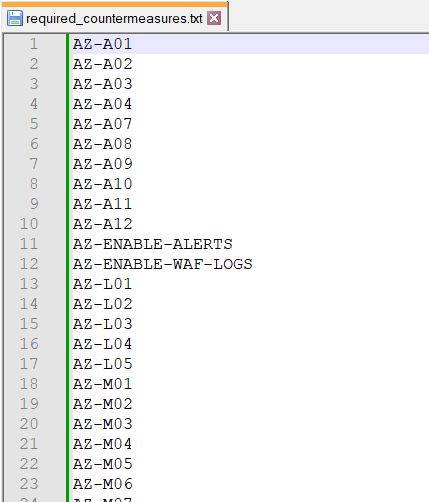
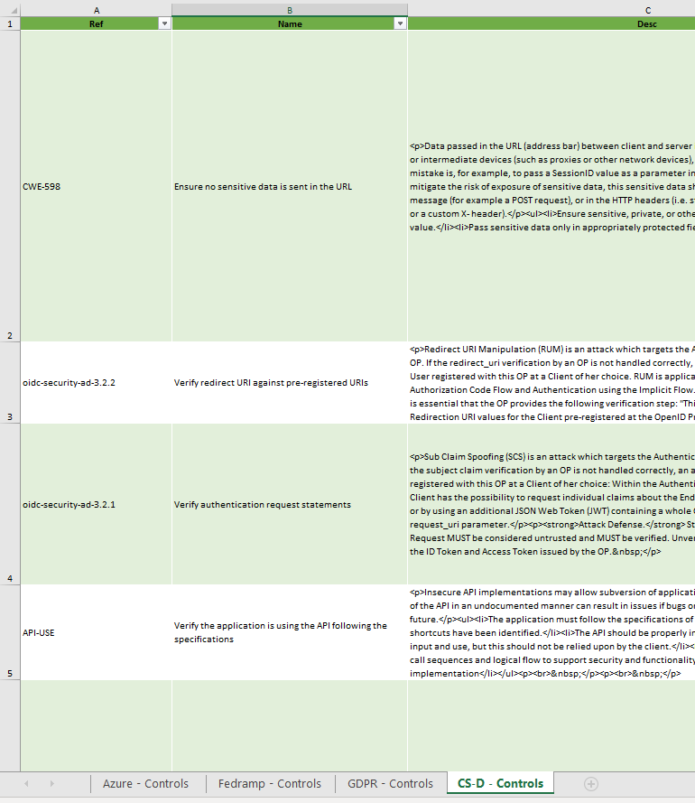
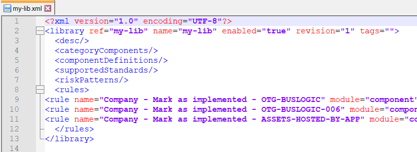

# Basic Rules Generator

This is a very simple script to generate rules that will mark a set of countermeasures as required or implemented if a component belongs to a specific trustzone.

## Disclaimer
This software is provided to you "as-is" and without warranty of any kind, express, implied or otherwise, including without limitation, any warranty of fitness for a particular purpose. If possible, this tool should not be deployed in a cloud environment, the Internet, or any other public network, as it has been developed to run on localhost. Doing so is at the user's own risk.

## How to use

Choose whether you want to generate the rules from a set of libraries from the file system or directly from the IriusRisk API.
After that, open a console and execute the script as follows:

```
cd basic-rules-generator
pip install -r requirements.txt
# To create the rules directly from the instance run the following command
python rules-generator.py --url <IriusRisk URL> --token <IriusRisk API token> --input <path/to/file/with/list/of/countermeasure> --mode <required/implemented>
# or to create the rules from XMLs 
python rules-generator.py --libs <path/to/libs> --input <path/to/file/with/list/of/countermeasure> --mode <required/implemented>
```
Parameters:
* (Option 1) 
  * **url** is the URL of an IriusRisk instance
  * **token** is the API token of an authenticated user in IriusRisk with enough permissions to access the security libraries
* (Option 2) 
  * **libs** is the folder where all the libraries are located
    * First step is to download all the libraries from IriusRisk and put them into a folder.
* **input** is the file containing the list of countermeasures. The script will generate one rule for each countermeasure
  * Avoid having whitespaces in the name of the file if possible
* **mode** accepts the values "required" and "implemented" and will create the appropriate action for the rule

The input can be both a simple txt/csv file containing the list of countermeasures or an Excel file with a Ref column.




To modify the trustzone you have two options:
* Search for "aaaaaaaa-bbbb-cccc-dddd-eeeeffff0000_::_trust-zone" and change it with your own trustzone uuid + ref
* Create the rules and find and replace aaaaaaaa-bbbb-cccc-dddd-eeeeffff0000_::_trust-zone on the library using a text editor

In the following image you can see how rules should be pasted into the library file that will be uploaded to IriusRisk:



Note that the rules are pasted between &lt;rules> and &lt;/rules> tags. 

## Expected output

Given a file with a list of countermeasures the output will be a list of strings, each one representing a complete rule node that must be copied to the library that will be uploaded to IriusRisk
This script doesn't modify any input file. The rules will be shown both in the console and in a file called rules.txt.

The purpose of only giving the rules instead of a working library is to avoid problems with changes in the XML schema that can cause import issues. It's just easier to copy and paste the rules into a custom working library.

### Example:

Input file (C:\path\to\input\file.txt):
```
DATA-VAL
CSMS-M10
```

Command (mark as required):

```
python rules-generator.py --url https://my-instance.iriusrisk.com --token XXXXXXXX-XXXX-XXXX-XXXX-XXXXXXXXXXXX --input C:\path\to\input\file.txt --mode required
```

Output:
```
Detected 2 to mark as implemented
Detected 3 countermeasures in custom-lib...
Detected 34 countermeasures in aws-lambda...
...
Detected 23 countermeasures in unece-wp-29-csms...
<rule name="Company - Mark as implemented - DATA-VAL" module="component" generatedByGui="true"><conditions><condition name="CONDITION_IS_IN_TRUSTZONE" field="id" value="aaaaaaaa-bbbb-cccc-dddd-eeeeffff0000_::_trust-zone"/></conditions><actions><action project="CS-Default" value="DATA-VAL_::_false" name="IMPLEMENT_CONTROL"/></actions></rule>
<rule name="Company - Mark as implemented - CSMS-M10" module="component" generatedByGui="true"><conditions><condition name="CONDITION_IS_IN_TRUSTZONE" field="id" value="aaaaaaaa-bbbb-cccc-dddd-eeeeffff0000_::_trust-zone"/></conditions><actions><action project="unece-wp-29-csms" value="CSMS-M10_::_false" name="IMPLEMENT_CONTROL"/></actions></rule>
Finished! Added 2 rules. You just need to copy the output from the rules.txt file to your library.
List of all countermeasures detected:     ['CSMS-M10', 'DATA-VAL']
List of all countermeasures added:        ['CSMS-M10', 'DATA-VAL']
List of all countermeasures not added:    []
```


## FAQ

### The rules say "Company" at the beginning of the rule name, how can I change this?

Find the word "Company" in the script and replace it with your company name or anything you want.

### Why do I need to download the libraries to execute this?

**Note: This is an optional step if you are not using the URL/Token method.**

The actions "Mark as required/implemented" have a parameter called "project" which is the ref of the library in which the countermeasure exists. If this value is not specified the rule won't appear correctly formatted in IriusRisk. To avoid that we need to specify the project but instead of doing it manually we just do it automatically by reading all the libraries.

### I have 600 countermeasures listed in my file but only 592 rules have been created. Shouldn't be also 600 rules?

This may occur if a countermeasure on the file doesn't exist in any of the existing libraries, which means we cannot set the "project" parameter mentioned above. This may be caused by some mismatch in the version number.

### I'd like to change some things in the script to adapt it to another use case

In case you want to customize the script to use another fixed condition you can just modify the "conditions" variable and add a valid condition to the script instead of the one that is hardcoded.

But if you need to do other major modifications feel free to do so.

### The script is not detecting the files

Ensure that the path you specified is correct and slashes/backslashes are correctly set.

